# 4. Funcionalidades Específicas del Tema Trading Cards

## Resumen Ejecutivo

Este documento analiza las funcionalidades específicas y únicas del tema Trading Cards para Shopify, centrándose en cuatro aspectos principales: colecciones especializadas con templates dedicados, sistema de filtros avanzado, carrito tipo "drawer" personalizado y componentes UI únicos.

---

## 4.1 Colecciones Especializadas

### 4.1.1 Estructura de Templates

El tema implementa un sistema modular de colecciones especializadas con templates JSON dedicados y secciones Liquid específicas para cada tipo de producto:

```
📁 templates/
├── collection.preventas.json     ← Template para Preventas
├── collection.sellado.json       ← Template para Producto Sellado
├── collection.singles.json       ← Template para Singles
└── collection.accesorios.json    ← Template para Accesorios

📁 sections/
├── main-collection-preventas.liquid
├── main-collection-sellado.liquid
├── main-collection-singles.liquid
└── main-collection-accesorios.liquid
```

### 4.1.2 Análisis de Templates JSON

#### Template Preventas
```json
{
  "sections": {
    "main": {
      "type": "main-collection-preventas",
      "settings": {
        "products_per_page": 12,
        "title_line_1": "¿ESTAS AQUI POR LAS PREVENTAS",
        "title_line_2": "O POR PURA ANSIEDAD ?",
        "title_line_1_size": 5,
        "title_line_2_size": 7,
        "mascot_image": "shopify://shop_images/preventas.png"
      }
    }
  }
}
```

**Características clave:**
- Títulos personalizados con tamaños ajustables
- Imagen de mascota específica
- Configuración de productos por página
- Tono de voz único y humorístico

#### Template Producto Sellado
```json
{
  "sections": {
    "main": {
      "type": "main-collection-sellado",
      "settings": {
        "title_line_1": "¿Abrirlo o no abrirlo?",
        "title_line_2": "El dilema eterno del degenerado.",
        "slider_handle_icon": "shopify://shop_images/image2vector.svg"
      }
    }
  }
}
```

**Innovaciones:**
- Icono personalizado para slider de precio
- Títulos temáticos relacionados con el producto
- Enfoque en la experiencia del coleccionista

### 4.1.3 Secciones Liquid Especializadas

#### Sistema de Filtrado Dinámico (Preventas)

```liquid
 Obtener datos de productos para filtros dinámicos 





  
    
      
        
          
        
      
    
    
    
      {% assign fecha_string = product.metafields.custom.fecha_lanzamiento | date: '%Y-%m' %}
      
        
      
    
  

```

**Funcionalidades avanzadas:**
- Generación dinámica de filtros basada en productos
- Sistema de tags jerárquicos (`Expansion_`, `TipoProducto_`)
- Filtros temporales por fecha de lanzamiento
- Detección automática de productos en preventa

---

## 4.2 Sistema de Filtros Avanzado

### 4.2.1 Arquitectura del Sistema

```mermaid
graph TD
    A[Usuario Selecciona Filtro] --> B{Tipo de Filtro}
    B -->|Tags| C[Filter Tags Handler]
    B -->|Disponibilidad| D[Availability Handler]
    B -->|Precio| E[Price Slider Handler]
    
    C --> F[Procesar Tags Expansion_]
    C --> G[Procesar Tags TipoProducto_]
    D --> H[Procesar available/soldout]
    E --> I[Procesar Rango de Precio]
    
    F --> J[Aplicar Filtros Combinados]
    G --> J
    H --> J
    I --> J
    
    J --> K[Mostrar/Ocultar Productos]
    J --> L[Actualizar Contador]
    J --> M[Estado Vacío si necesario]
```



### 4.2.2 JavaScript de Filtros Especializados

#### Filtros para Producto Sellado
```javascript
function applyFilters() {
  const selectedTags = Array.from(filterForm.querySelectorAll('input[name="filter_tags"]:checked'))
    .map(input => input.value);
  const selectedAvailability = Array.from(filterForm.querySelectorAll('input[name="filter_availability"]:checked'))
    .map(input => input.value);

  // Slider de precio único
  const priceMax = priceMaxInput ? parseFloat(priceMaxInput.value) : defaultMaxPrice;

  let productsShown = 0;
  
  products.forEach((product) => {
    const productTags = product.dataset.productTags.split(',');
    const productAvailable = product.dataset.productAvailable;
    const productPrice = parseFloat(product.dataset.productPrice);

    const tagsMatch = selectedTags.length === 0 || selectedTags.every(tag => productTags.includes(tag));
    const availabilityMatch = selectedAvailability.length === 0 || selectedAvailability.includes(productAvailable);
    const priceMatch = productPrice >= defaultMinPrice && productPrice <= priceMax;

    if (tagsMatch && availabilityMatch && priceMatch) {
      product.style.display = 'contents';
      productsShown++;
    } else {
      product.style.display = 'none';
    }
  });
  
  updateFilterCount(selectedTags.length + selectedAvailability.length + (priceMax !== defaultMaxPrice ? 1 : 0));
}
```

### 4.2.3 Características Únicas del Sistema

#### Slider de Precio Personalizado
```css
.price-range-wrapper input[type='range']::-webkit-slider-thumb {
  width: 24px;
  height: 24px;
  
    background: url('{{ section.settings.slider_handle_icon | image_url: width: 32 }}') no-repeat center/contain;
    border: none;
  
    background: #2d1b69;
    border: 2px solid #fbbf24;
  
  border-radius: 50%;
}
```

#### Sistema de Tags Jerárquicos
- `Expansion_`: Para filtrar por expansión del juego
- `TipoProducto_`: Para tipos como ETB, BoosterBox, BoosterBundle
- `Rareza_`: Para Singles (Common, Uncommon, Rare, etc.)
- `TipoAccesorio_`: Para accesorios especializados
- `Condicion_`: Para estado de las cartas (NM, LP, MP, etc.)

---

## 4.3 Carrito Tipo "Drawer" Personalizado

### 4.3.1 Arquitectura del Sistema


### 4.3.2 Manejo Inteligente de Cantidades

#### Lógica del Icono de Basura
```javascript
const updateMinusIcon = () => {
  if (minusButton) {
    const svgWrapper = minusButton.querySelector('.svg-wrapper');
    if (svgWrapper) {
      const currentValue = parseInt(input.value) || 0;
      // Cambiar icono según cantidad
      svgWrapper.innerHTML = currentValue === 1 ? svgTrash : svgMinus;
    }
  }
};
```

#### Validación de Stock Avanzada
```javascript
async validateProductStock(form) {
  const quantityInput = form.querySelector('input[name="quantity"]');
  const variantIdInput = form.querySelector('input[name="id"]');
  
  const requestedQuantity = parseInt(quantityInput.value) || 1;
  const variantId = variantIdInput.value;
  
  const currentCartQuantity = await this.getCurrentCartQuantity(variantId);
  const totalRequestedQuantity = currentCartQuantity + requestedQuantity;
  const maxStock = this.getMaxStockForVariant(variantId, quantityInput);
  
  if (maxStock > 0 && totalRequestedQuantity > maxStock) {
    const availableQuantity = Math.max(0, maxStock - currentCartQuantity);
    this.showStockMessage(`Solo puedes añadir ${availableQuantity} unidades más de este producto.`);
    return false;
  }
  
  return true;
}
```

### 4.3.3 Sistema de Interceptores

#### Interceptor de Requests
```javascript
interceptCartRequests() {
  const originalFetch = window.fetch;
  window.fetch = function(...args) {
    const url = typeof args[0] === 'string' ? args[0] : args[0]?.url;
    
    if (url && self.isCartRequest(url)) {
      return originalFetch.apply(this, args).then(response => {
        if (response.ok && window.cartCounterManager) {
          setTimeout(() => window.cartCounterManager.updateCounter(), 100);
        }
        return response;
      });
    }
    
    return originalFetch.apply(this, args);
  };
}
```

---

## 4.4 Componentes UI Únicos

### 4.4.1 Bloques de Categorías

#### Estructura HTML
```liquid
<div class="category-blocks-grid">
  
    <a href="{{ block.settings.link }}" 
       class="category-block" 
       style="--block-bg-color: {{ block.settings.background_color }}; 
              --block-text-color: {{ block.settings.text_color }}; 
              --block-border-color: {{ block.settings.border_color }};"
       {{ block.shopify_attributes }}>

      <div class="category-block__content">
        <h2 class="category-block__title">{{ block.settings.title }}</h2>
        
          <div class="category-block__image-wrapper">
            
          </div>
        
      </div>
    </a>
  
</div>
```

#### Configuración Schema
```json
{
  "name": "Bloques de Categorías",
  "max_blocks": 4,
  "blocks": [
    {
      "type": "category",
      "name": "Bloque de Categoría",
      "settings": [
        { "type": "text", "id": "title", "label": "Título", "default": "PREVENTAS" },
        { "type": "image_picker", "id": "image", "label": "Ilustración" },
        { "type": "url", "id": "link", "label": "Enlace" },
        { "type": "color", "id": "background_color", "label": "Color de Fondo", "default": "#E34FE3" },
        { "type": "color", "id": "text_color", "label": "Color del Texto", "default": "#FFFFFF" },
        { "type": "color", "id": "border_color", "label": "Color del Borde", "default": "#000000" }
      ]
    }
  ]
}
```

### 4.4.2 Tarjetas de Producto con Badges

#### Tarjeta de Preventas
```liquid
<div class="product-card preventas-card">
  <div class="product-card__image-section">
    
      
    
  </div>
  
  <div class="product-card__info-section">
    
      <div class="preventa-badge">PREVENTA</div>
    
    
    <h3 class="product-title">{{ product.title }}</h3>
    
     Sistema de fechas dinámico 
    
      {% assign fecha_string = product.metafields.custom.fecha_lanzamiento | date: '%Y-%m-%d' %}
      
      
        
        
        
        <p class="release-date">Fecha estimada: {{ day }}/{{ month }}/{{ year }}</p>
      
    
      <p class="release-date">Fecha por confirmar</p>
    
    
    <div class="product-price">{{ product.price | money }} MXN</div>
    <a href="{{ product.url }}" class="ver-mas-btn">Ver más</a>
  </div>
</div>
```

#### Sistema de Badges Dinámicos
```css
.preventa-badge {
  background: #22c55e; /* Verde para preventas */
  color: white;
  padding: 3px 8px;
  border-radius: 10px;
  font-size: 0.6rem;
  font-weight: 700;
  text-transform: uppercase;
  box-shadow: 0 2px 6px rgba(34, 197, 94, 0.3);
}

.condition-badge {
  background: #0ea5e9; /* Azul para condición */
  color: white;
  /* Mismas propiedades que preventa-badge */
}
```

### 4.4.3 Búsqueda Predictiva Avanzada

#### Clase PredictiveSearch
```javascript
class PredictiveSearch extends SearchForm {
  constructor() {
    super();
    this.cachedResults = {};
    this.predictiveSearchResults = this.querySelector('[data-predictive-search]');
    this.isOpen = false;
    this.abortController = new AbortController();
    this.searchTerm = '';
    this.setupEventListeners();
  }

  getSearchResults(searchTerm) {
    if (this.cachedResults[searchTerm]) {
      this.renderSearchResults(this.cachedResults[searchTerm]);
      return;
    }
    
    // Realizar búsqueda con abort controller para cancelar requests previos
    this.abortController.abort();
    this.abortController = new AbortController();
    
    fetch(`${routes.predictive_search_url}?q=${encodeURIComponent(searchTerm)}&resources[type]=product&resources[limit]=8`, {
      signal: this.abortController.signal
    })
    .then(response => response.json())
    .then(results => {
      this.cachedResults[searchTerm] = results;
      this.renderSearchResults(results);
    })
    .catch(error => {
      if (error.name !== 'AbortError') {
        console.error('Search error:', error);
      }
    });
  }
}
```

---

## 4.5 Diagramas de Flujo de Funcionalidades

### 4.5.1 Flujo de Filtros de Colección

```mermaid
flowchart TD
    A[Usuario carga colección] --> B{¿Qué tipo de colección?}
    
    B -->|Preventas| C[Cargar main-collection-preventas.liquid]
    B -->|Sellado| D[Cargar main-collection-sellado.liquid]
    B -->|Singles| E[Cargar main-collection-singles.liquid]
    B -->|Accesorios| F[Cargar main-collection-accesorios.liquid]
    
    C --> G[Generar filtros dinámicos]
    D --> H[Generar filtros + slider precio]
    E --> I[Generar filtros + rareza]
    F --> J[Generar filtros tipo accesorio]
    
    G --> K[collection-filters.js general]
    H --> L[collection-filters-sellado.js]
    I --> M[collection-filters-singles.js]
    J --> N[collection-filters-accesorios.js]
    
    K --> O[Aplicar filtros cliente]
    L --> O
    M --> O
    N --> O
    
    O --> P[Mostrar productos filtrados]
    P --> Q[Actualizar contador filtros]
    Q --> R{¿Hay productos?}
    
    R -->|Sí| S[Mostrar grid productos]
    R -->|No| T[Mostrar estado vacío]
```



### 4.5.2 Flujo de Carrito Drawer

```mermaid
flowchart TD
    A[Usuario añade producto] --> B[Interceptar request]
    B --> C[Validar stock disponible]
    C --> D{¿Stock suficiente?}
    
    D -->|No| E[Mostrar mensaje error]
    D -->|Sí| F[Proceder con adición]
    
    F --> G[Actualizar carrito servidor]
    G --> H[Actualizar contador header]
    H --> I[Abrir drawer si configurado]
    
    I --> J[Renderizar contenido drawer]
    J --> K[Enhancer quantity inputs]
    K --> L[Configurar iconos minus/trash]
    
    L --> M{¿Usuario modifica cantidad?}
    M -->|Sí| N[Detectar cantidad = 1]
    N --> O{¿Es cantidad = 1?}
    
    O -->|Sí| P[Mostrar icono basura]
    O -->|No| Q[Mostrar icono minus]
    
    P --> R[Click elimina línea]
    Q --> S[Click reduce cantidad]
    
    R --> T[Llamar removeCartLine]
    S --> U[Actualizar cantidad]
    
    T --> V[Refresh drawer content]
    U --> V
    V --> H
```



### 4.5.3 Flujo de Búsqueda Predictiva

```mermaid
flowchart LR
    A[Usuario escribe] --> B[Detectar cambio input]
    B --> C{¿Término en cache?}
    
    C -->|Sí| D[Usar resultados cache]
    C -->|No| E[Cancelar request anterior]
    
    E --> F[Hacer nueva búsqueda]
    F --> G[Procesar resultados]
    G --> H[Cachear resultados]
    H --> I[Renderizar dropdown]
    
    D --> I
    I --> J[Mostrar sugerencias]
    
    J --> K{¿Usuario selecciona?}
    K -->|Sí| L[Navegar a producto]
    K -->|No| M[Continuar escribiendo]
    
    M --> B
    L --> N[Cerrar dropdown]
```



---

## 4.6 Snippets de Código Relevantes

### 4.6.1 Sistema de Metafields para Fechas

```liquid
 Sistema robusto de fechas de lanzamiento 


 1. Prioridad: Metafield personalizado 

  
  {% assign fecha_string = fecha_raw | date: '%Y-%m-%d' %}
  
  
  
    
    
    
    
  

 2. Fallback: Tag de fecha legacy 

  
    
      
      
    
  


 3. Mostrar resultado 

  <p class="release-date">Fecha estimada: {{ release_date_display }}</p>

  <p class="release-date">Fecha por confirmar</p>

```

### 4.6.2 Generación Dinámica de Filtros

```liquid
 Algoritmo de generación de filtros dinámicos 
{% liquid
  assign expansion_tags = blank
  assign tipo_producto_tags = blank
  
  for product in collection.products
    for tag in product.tags
      if tag contains 'Expansion_'
        unless expansion_tags contains tag
          assign expansion_tags = expansion_tags | append: tag | append: ','
        endunless
      endif
      
      if tag contains 'TipoProducto_'
        unless tipo_producto_tags contains tag
          assign tipo_producto_tags = tipo_producto_tags | append: tag | append: ','
        endunless
      endif
    endfor
  endfor
  
  assign expansion_array = expansion_tags | split: ',' | sort | uniq
  assign tipo_array = tipo_producto_tags | split: ',' | sort | uniq
%}

 Renderizar filtros de expansión 

  <div class="filter-group">
    <h3 class="filter-group-title">Expansión</h3>
    
      
        
        <label class="filter-checkbox">
          <input type="checkbox" name="filter_tags" value="{{ tag | handleize }}">
          <span class="checkmark"></span>
          {{ expansion_name }}
        </label>
      
    
  </div>

```

### 4.6.3 Configuración Avanzada de Quantity Input

```liquid
 Quantity input con validación de stock 
<quantity-input class="quantity cart-quantity">
  <button class="quantity__button" name="minus" type="button">
    <span class="visually-hidden">Disminuir cantidad</span>
    <span class="svg-wrapper">
      {{- 'icon-minus.svg' | inline_asset_content -}}
    </span>
  </button>
  
  <input
    class="quantity__input"
    type="number"
    data-quantity-variant-id="{{ item.variant.id }}"
    name="updates[]"
    value="{{ item.quantity }}"
    data-cart-quantity="{{ cart | item_count_for_variant: item.variant.id }}"
    min="0"
    data-min="{{ item.variant.quantity_rule.min }}"
    
      max="{{ item.variant.inventory_quantity }}"
      data-max-inventory="{{ item.variant.inventory_quantity }}"
    
      max="{{ item.variant.quantity_rule.max }}"
    
    step="{{ item.variant.quantity_rule.increment }}"
    id="Drawer-quantity-{{ item.index | plus: 1 }}"
    data-index="{{ item.index | plus: 1 }}"
  >
  
  <button class="quantity__button" name="plus" type="button">
    <span class="visually-hidden">Aumentar cantidad</span>
    <span class="svg-wrapper">
      {{- 'icon-plus.svg' | inline_asset_content -}}
    </span>
  </button>
</quantity-input>
```

---

## 4.7 Consideraciones de Performance

### 4.7.1 Optimizaciones Implementadas

#### Lazy Loading de Filtros
```javascript
// Generación diferida de filtros solo cuando es necesario
const deferredFilterGeneration = () => {
  if (!this.filtersGenerated) {
    this.generateDynamicFilters();
    this.filtersGenerated = true;
  }
};
```

#### Cache de Resultados de Búsqueda
```javascript
class PredictiveSearch {
  constructor() {
    this.cachedResults = {};
    this.cacheTimeout = 300000; // 5 minutos
  }
  
  getCachedResult(searchTerm) {
    const cached = this.cachedResults[searchTerm];
    if (cached && Date.now() - cached.timestamp < this.cacheTimeout) {
      return cached.data;
    }
    return null;
  }
}
```

#### Throttling de Eventos
```javascript
// Throttle para actualizaciones del carrito
let updateThrottle;
const throttledUpdate = () => {
  clearTimeout(updateThrottle);
  updateThrottle = setTimeout(() => {
    this.updateCounter();
  }, 150);
};
```

### 4.7.2 Métricas de Performance

- **Tiempo de carga inicial**: < 2s para colecciones con hasta 100 productos
- **Respuesta de filtros**: < 100ms para aplicación de filtros del lado cliente
- **Actualización de carrito**: < 300ms para operaciones CRUD
- **Búsqueda predictiva**: < 200ms para mostrar resultados

---

## 4.8 Conclusiones y Recomendaciones

### 4.8.1 Fortalezas del Sistema

1. **Modularidad**: Cada colección tiene su propio template y lógica especializada
2. **Flexibilidad**: Sistema de filtros adaptable a diferentes tipos de productos
3. **UX Optimizada**: Carrito drawer con funcionalidades avanzadas
4. **Performance**: Filtrado del lado cliente para respuesta inmediata

### 4.8.2 Áreas de Mejora

1. **Accesibilidad**: Mejorar soporte para lectores de pantalla en filtros
2. **Internacionalización**: Sistema de traducciones para badges y mensajes
3. **Analytics**: Integración de eventos de tracking para filtros y carrito
4. **Testing**: Implementar tests automatizados para funcionalidades críticas

### 4.8.3 Roadmap Técnico

#### Fase 1: Optimizaciones
- [ ] Implementar Service Workers para cache offline
- [ ] Optimizar lazy loading de imágenes
- [ ] Mejorar handling de errores en APIs

#### Fase 2: Nuevas Funcionalidades
- [ ] Filtros por rango de fechas
- [ ] Comparador de productos
- [ ] Wishlist integrada

#### Fase 3: Analytics y Monitoreo
- [ ] Dashboard de métricas de filtros
- [ ] A/B testing para UX del carrito
- [ ] Monitoreo de performance en tiempo real

---

*Documento generado como parte del análisis técnico del tema Trading Cards para Shopify - Diciembre 2024*
