# Documentación de Diseño y Experiencia de Usuario - Ungraded

## Tabla de Contenidos

1. [Principios de Branding](#1-principios-de-branding)
2. [Diseño Responsive](#2-diseño-responsive)
3. [Componentes TCG-oriented](#3-componentes-tcg-oriented)
4. [Flujo de Usuario](#4-flujo-de-usuario)

---

## 1. Principios de Branding

### 1.1 Identidad Ungraded

**Filosofía de Marca:**
- **Autenticidad Brutal**: Mensajes directos que conectan con la psicología del coleccionista
- **Especialización Total**: Enfoque exclusivo en Trading Card Games
- **Cultura Degenerada**: Abraza el humor irreverente de la comunidad TCG
- **Transparencia**: Información clara sobre stock, condición y precios

**Tono de Comunicación:**
```
• Conversacional y directo
• Uso de referencias culturales gaming
• Humor sin perder profesionalismo
• Mensajes como "¿ABRIRLO O NO ABRIRLO? EL DILEMA ETERNO DEL DEGENERADO"
```

### 1.2 Uso de shadcn/ui

**Framework de Componentes:**
- **Consistencia**: Elementos de interfaz estandarizados
- **Accesibilidad**: Componentes que cumplen estándares WCAG
- **Personalización**: Adaptación a la identidad visual de Ungraded
- **Escalabilidad**: Sistema modular para crecimiento futuro

**Implementación en el Proyecto:**
```css
/* Variables CSS conectadas con shadcn/ui */
:root {
  --buttons-radius: 0px;
  --buttons-border-width: 1px;
  --buttons-border-opacity: 1;
  --product-card-corner-radius: 0rem;
  --media-radius: 0px;
}
```

### 1.3 Paleta Slate como Base

**Esquemas de Color Implementados:**

#### Scheme-1: Principal Blanco
```json
{
  "background": "#ffffff",
  "text": "#121212",
  "button": "#121212",
  "button_label": "#ffffff"
}
```

#### Scheme-2: Gris Claro  
```json
{
  "background": "#f3f3f3",
  "text": "#121212",
  "button": "#121212",
  "button_label": "#f3f3f3"
}
```

#### Scheme-3: Gris Oscuro
```json
{
  "background": "#242833",
  "text": "#ffffff",
  "button": "#ffffff",
  "button_label": "#000000"
}
```

#### Scheme-4: Negro
```json
{
  "background": "#121212",
  "text": "#ffffff",
  "button": "#ffffff",
  "button_label": "#121212"
}
```

**Ventajas de la Paleta Slate:**
- **Neutralidad**: Permite que las cartas sean protagonistas visuales
- **Versatilidad**: Se adapta a diferentes tipos de producto
- **Coherencia**: Refuerza identidad profesional
- **Accesibilidad**: Contrastes apropiados para todos los usuarios

### 1.4 Tipografías del Sistema

**Jerarquía Tipográfica:**
```css
/* Familias de fuentes definidas */
:root {
  --font-family-titles: 'Tanker', sans-serif;        /* H1-H6 */
  --font-family-subtitles: 'Troylinesans-Regular', sans-serif; /* Subtítulos */
  --font-family-textos: 'Teco', sans-serif;         /* Párrafos */
  --font-family-web: 'Acumin Variable Concept', sans-serif;   /* Base */
}
```

**Aplicación en la Interfaz:**
- **Títulos principales**: Tanker (impacto visual)
- **Navegación**: Troylinesans (legibilidad)
- **Contenido**: Teco (lectura fluida)
- **Elementos web**: Acumin Variable (versatilidad)

---

## 2. Diseño Responsive

### 2.1 Breakpoints del Sistema

**Estructura de Breakpoints:**
```css
/* Desktop First Approach */
@media (max-width: 1000px) { /* Tablets */ }
@media (max-width: 768px)  { /* Móviles grandes */ }
@media (max-width: 480px)  { /* Móviles estándar */ }
@media (max-width: 360px)  { /* Móviles pequeños */ }
@media (max-width: 320px)  { /* Móviles muy pequeños */ }
```

**Variables Responsivas:**
```css
:root {
  /* Header responsive */
  --header-logo-height-desktop: 65px;
  --header-logo-height-tablet: 60px;
  --header-logo-height-mobile: 35px;
  
  /* Iconos responsive */
  --header-icons-size: 40px; /* Desktop */
  /* Tablet: 36px, Móvil: 32px */
}
```

### 2.2 Clases Utilitarias

**Grid System:**
```css
.page-width {
  max-width: 1200px;
  margin: 0 auto;
  padding: 0 var(--page-padding);
}

.grid {
  display: grid;
  gap: var(--grid-desktop-horizontal-spacing);
}

@media (max-width: 768px) {
  .grid {
    grid-template-columns: 1fr;
    gap: var(--grid-mobile-spacing);
  }
}
```

**Utilidades de Espaciado:**
```css
.spacing-sections {
  margin-bottom: var(--spacing-sections-desktop);
}

@media (max-width: 768px) {
  .spacing-sections {
    margin-bottom: var(--spacing-sections-mobile);
  }
}
```

### 2.3 Tamaño de Imágenes Adaptativo

**Sistema image_url Width:**
```liquid
<!-- Implementación en product cards -->


<!-- Responsive con srcset -->

```

**Optimizaciones por Dispositivo:**
- **Desktop**: 600px width máximo
- **Tablet**: 300px width óptimo
- **Móvil**: 150px-300px según contexto
- **Lazy loading**: Implementado por defecto

### 2.4 Comportamiento de Componentes

**Navigation Responsive:**
```css
/* Desktop: Navegación horizontal */
.main-navigation {
  display: flex;
  gap: 2rem;
}

/* Mobile: Drawer navigation */
@media (max-width: 1000px) {
  .main-navigation {
    position: fixed;
    top: 0;
    right: -300px;
    width: 300px;
    height: 100vh;
    flex-direction: column;
    transition: right 0.3s ease;
  }
  
  .main-navigation.active {
    right: 0;
  }
}
```

**Search Bar Adaptativo:**
```css
.search-bar-container.search-bar-active {
  /* Desktop */
  width: min(500px, calc(100vw - 100px));
}

@media (max-width: 768px) {
  .search-bar-container.search-bar-active {
    width: min(400px, calc(100vw - 100px));
  }
}

@media (max-width: 480px) {
  .search-bar-container.search-bar-active {
    width: min(320px, calc(100vw - 80px));
  }
}
```

---

## 3. Componentes TCG-oriented

### 3.1 Sistema de Mascotas

**Implementación por Colección:**
```liquid
<!-- Mascota personalizada por sección -->
<div class="mascot-container">
  
    
  
    <div class="mascot-character">
      <div class="mascot-simple">
        <div class="mascot-icon">📦</div>
        <div class="mascot-text">SELLADO</div>
      </div>
    </div>
  
</div>
```

**Mascotas por Tipo de Producto:**
- **Singles**: 🃏 Character específico para cartas individuales
- **Sellado**: 📦 Character para productos sellados
- **Preventas**: ⏰ Character para pre-órdenes
- **Accesorios**: 🎯 Character para accesorios

**CSS de Mascotas:**
```css
.mascot-container {
  display: flex;
  align-items: center;
  justify-content: center;
}

.mascot-image {
  max-width: 200px;
  height: auto;
  object-fit: contain;
}

.mascot-simple {
  text-align: center;
  color: var(--color-accent-yellow);
}

.mascot-icon {
  font-size: 3rem;
  margin-bottom: 0.5rem;
}

.mascot-text {
  font-family: var(--font-family-titles);
  font-size: 1.2rem;
  font-weight: bold;
}
```

### 3.2 Badges de "Condición"

**Sistema de Badges Dinámicos:**
```liquid
<!-- Badge de condición basado en metafields -->

  <span class="condition-badge condition-{{ product.metafields.custom.condicion | handleize }}">
    {{ product.metafields.custom.condicion }}
  </span>


<!-- Badge de rareza -->

  
    
    <span class="rarity-badge rarity-{{ rareza | handleize }}">
      {{ rareza }}
    </span>
  

```

**Estilos de Badges:**
```css
.condition-badge {
  display: inline-block;
  padding: 0.2rem 0.6rem;
  border-radius: var(--badge-corner-radius);
  font-size: 0.8rem;
  font-weight: bold;
  text-transform: uppercase;
}

/* Condiciones específicas */
.condition-mint {
  background: #22c55e;
  color: white;
}

.condition-near-mint {
  background: #3b82f6;
  color: white;
}

.condition-lightly-played {
  background: #f59e0b;
  color: white;
}

.condition-moderately-played {
  background: #ef4444;
  color: white;
}

/* Badges de rareza */
.rarity-badge {
  margin-left: 0.5rem;
  border: 1px solid currentColor;
}

.rarity-common {
  background: #6b7280;
  color: white;
}

.rarity-uncommon {
  background: #10b981;
  color: white;
}

.rarity-rare {
  background: #3b82f6;
  color: white;
}

.rarity-mythic {
  background: #f59e0b;
  color: white;
}
```

### 3.3 Bloques de Expansión

**Sistema de Filtros por Expansión:**
```liquid
<!-- Generación dinámica de filtros de expansión -->


  
    
      
        
      
    
  




  <div class="filter-group">
    <h3 class="filter-group-title">Expansión</h3>
    
      
        
        <label class="filter-checkbox">
          <input type="checkbox" name="filter_tags" value="{{ tag | handleize }}">
          <span class="checkmark"></span>
          {{ expansion_name }}
        </label>
      
    
  </div>

```

**Bloques de Expansión Visual:**
```css
.expansion-block {
  background: linear-gradient(135deg, var(--color-background) 0%, rgba(var(--color-foreground), 0.05) 100%);
  border: 1px solid rgba(var(--color-foreground), 0.1);
  border-radius: 8px;
  padding: 1rem;
  margin-bottom: 1rem;
  transition: transform 0.2s ease, box-shadow 0.2s ease;
}

.expansion-block:hover {
  transform: translateY(-2px);
  box-shadow: 0 4px 12px rgba(0, 0, 0, 0.1);
}

.expansion-title {
  font-family: var(--font-family-titles);
  font-size: 1.1rem;
  font-weight: bold;
  margin-bottom: 0.5rem;
  color: var(--color-accent-yellow);
}

.expansion-count {
  font-size: 0.9rem;
  color: rgba(var(--color-foreground), 0.7);
}
```

### 3.4 Componentes de Producto TCG

**Card Layout Especializado:**
```css
.tcg-product-card {
  display: flex;
  flex-direction: column;
  background: var(--color-background);
  border: 1px solid rgba(var(--color-foreground), 0.1);
  border-radius: var(--product-card-corner-radius);
  overflow: hidden;
  transition: transform 0.2s ease, box-shadow 0.2s ease;
}

.tcg-product-card:hover {
  transform: translateY(-4px);
  box-shadow: 0 8px 24px rgba(0, 0, 0, 0.12);
}

.tcg-card-image {
  position: relative;
  width: 100%;
  aspect-ratio: 1;
  overflow: hidden;
}

.tcg-card-info {
  padding: 1rem;
  flex-grow: 1;
  display: flex;
  flex-direction: column;
}

.tcg-card-title {
  font-family: var(--font-family-titles);
  font-size: 1.1rem;
  line-height: 1.3;
  margin-bottom: 0.5rem;
}

.tcg-card-badges {
  display: flex;
  gap: 0.5rem;
  flex-wrap: wrap;
  margin-bottom: 0.75rem;
}

.tcg-card-price {
  margin-top: auto;
  font-family: var(--font-family-titles);
  font-size: 1.2rem;
  font-weight: bold;
  color: var(--color-accent-yellow);
}
```

**Quantity Input TCG:**
```liquid
<!-- Quantity input especializado para TCG -->
<quantity-input class="quantity tcg-quantity">
  <button class="quantity__button" name="minus" type="button">
    <span class="visually-hidden">Disminuir cantidad</span>
    <span class="svg-wrapper">
      {{- 'icon-minus.svg' | inline_asset_content -}}
    </span>
  </button>
  
  <input
    class="quantity__input"
    type="number"
    name="quantity"
    min="1"
    max="{{ product.selected_or_first_available_variant.inventory_quantity }}"
    value="1"
    data-max-inventory="{{ product.selected_or_first_available_variant.inventory_quantity }}"
  >
  
  <button class="quantity__button" name="plus" type="button">
    <span class="visually-hidden">Aumentar cantidad</span>
    <span class="svg-wrapper">
      {{- 'icon-plus.svg' | inline_asset_content -}}
    </span>
  </button>
</quantity-input>
```

---

## 4. Flujo de Usuario

### 4.1 Arquitectura de Navegación

**Flujo Principal: Home → Categoría → Colección → Producto → Checkout**

```mermaid
graph TD
    A[Homepage] --> B{Categorías principales}
    
    B --> C[Singles]
    B --> D[Sellado]
    B --> E[Preventas]
    B --> F[Accesorios]
    
    C --> G[Colección Singles]
    D --> H[Colección Sellado]
    E --> I[Colección Preventas]
    F --> J[Colección Accesorios]
    
    G --> K[Producto Individual]
    H --> K
    I --> K
    J --> K
    
    K --> L[Agregar al Carrito]
    L --> M{¿Continuar comprando?}
    
    M -->|Sí| N[Volver a colección]
    M -->|No| O[Ver Carrito]
    
    O --> P[Checkout]
    P --> Q[Finalizar Compra]
    
    N --> G
    N --> H
    N --> I
    N --> J
```



### 4.2 Homepage - Punto de Entrada

**Estructura de la Homepage:**
```liquid
<!-- Hero Section -->
<section class="hero-section">
  <div class="hero-content">
    <h1 class="hero-title">{{ section.settings.hero_title | default: 'UNGRADED' }}</h1>
    <p class="hero-subtitle">{{ section.settings.hero_subtitle | default: 'Trading Cards sin límites' }}</p>
    <div class="hero-cta">
      <a href="{{ section.settings.primary_cta_url }}" class="btn btn-primary">
        {{ section.settings.primary_cta_text | default: 'Explorar Catálogo' }}
      </a>
    </div>
  </div>
  
  <!-- Mascota principal -->
  <div class="hero-mascot">
    
      
    
  </div>
</section>

<!-- Categorías principales -->
<section class="category-grid">
  <div class="page-width">
    <div class="category-blocks">
      <a href="/collections/singles" class="category-block category-singles">
        <div class="category-icon">🃏</div>
        <h3 class="category-title">SINGLES</h3>
        <p class="category-desc">Cartas individuales</p>
      </a>
      
      <a href="/collections/sellado" class="category-block category-sellado">
        <div class="category-icon">📦</div>
        <h3 class="category-title">SELLADO</h3>
        <p class="category-desc">Productos sellados</p>
      </a>
      
      <a href="/collections/preventas" class="category-block category-preventas">
        <div class="category-icon">⏰</div>
        <h3 class="category-title">PREVENTAS</h3>
        <p class="category-desc">Pre-órdenes</p>
      </a>
      
      <a href="/collections/accesorios" class="category-block category-accesorios">
        <div class="category-icon">🎯</div>
        <h3 class="category-title">ACCESORIOS</h3>
        <p class="category-desc">Complementos</p>
      </a>
    </div>
  </div>
</section>
```

### 4.3 Páginas de Colección - Filtrado y Búsqueda

**Elementos de la Página de Colección:**

1. **Header con Mascota**
```liquid
<div class="collection-header">
  <div class="header-title">
    <div class="title-line-1">CATÁLOGO DE</div>
    <div class="title-line-2">{{ collection.title | upcase }}</div>
  </div>
  <div class="mascot-container">
    <!-- Mascota específica de la colección -->
  </div>
</div>
```

2. **Sidebar de Filtros**
```liquid
<div class="collection-sidebar">
  <form class="collection-filters-form">
    <!-- Filtros dinámicos por disponibilidad -->
    <!-- Filtros por rango de precio -->
    <!-- Filtros por expansión -->
    <!-- Filtros por tipo de producto -->
    <!-- Filtros por rareza (Singles) -->
    <!-- Filtros por condición (Singles) -->
  </form>
</div>
```

3. **Grid de Productos**
```liquid
<div class="product-grid">
  
    <div class="product-wrapper" data-tags="{{ product.tags | join: ',' | handleize }}">
      
    </div>
  
</div>
```

### 4.4 Página de Producto - Información Detallada

**Estructura de Producto Individual:**

1. **Media Gallery**
```liquid
<div class="product-media">
  <div class="product-media-gallery">
    <!-- Carrusel de imágenes -->
    <!-- Zoom en hover/click -->
    <!-- Thumbnails navegables -->
  </div>
</div>
```

2. **Product Information**
```liquid
<div class="product-info">
  <h1 class="product-title">{{ product.title }}</h1>
  
  <!-- Badges de información -->
  <div class="product-badges">
    
  </div>
  
  <!-- Precio -->
  <div class="product-price">
    
  </div>
  
  <!-- Variant selector -->
  
    
  
  
  <!-- Quantity y Add to Cart -->
  <div class="product-form">
    
  </div>
  
  <!-- Información adicional -->
  <div class="product-details">
    
      <div class="product-description">
        {{ product.description }}
      </div>
    
  </div>
</div>
```

### 4.5 Cart Drawer - Experiencia de Checkout

**Cart Drawer Personalizado:**
```liquid
<cart-drawer class="drawer cart-drawer">
  <div class="cart-drawer-header">
    <h2 class="cart-drawer-title">Tu Colección</h2>
    <button class="cart-drawer-close" aria-label="Cerrar carrito">
      <!-- Icono de cierre -->
    </button>
  </div>
  
  <div class="cart-drawer-items">
    
      <div class="cart-item">
        <!-- Imagen del producto -->
        <!-- Información del producto -->
        <!-- Quantity controls -->
        <!-- Precio -->
        <!-- Remove button -->
      </div>
    
  </div>
  
  <div class="cart-drawer-footer">
    <div class="cart-totals">
      <div class="cart-subtotal">
        Subtotal: {{ cart.total_price | money }}
      </div>
    </div>
    
    <div class="cart-actions">
      <a href="/cart" class="btn btn-secondary">Ver Carrito</a>
      <button type="submit" class="btn btn-primary" name="add" form="cart">
        Finalizar Compra
      </button>
    </div>
  </div>
</cart-drawer>
```

### 4.6 Responsive User Flow

**Adaptaciones por Dispositivo:**

**Desktop (>1000px):**
- Navegación horizontal completa
- Sidebar de filtros visible
- Grid de 3-4 productos por fila
- Cart drawer lateral

**Tablet (768px-1000px):**
- Navegación colapsible
- Filtros en drawer
- Grid de 2-3 productos por fila
- Cart drawer overlay completo

**Mobile (<768px):**
- Navegación hamburguesa
- Filtros en modal fullscreen
- Grid de 1-2 productos por fila
- Cart drawer fullscreen

### 4.7 Micro-interacciones y Feedback

**Estados de Interacción:**
```css
/* Hover states */
.tcg-product-card:hover {
  transform: translateY(-4px);
  box-shadow: 0 8px 24px rgba(0, 0, 0, 0.12);
}

/* Loading states */
.btn-loading {
  position: relative;
  color: transparent;
}

.btn-loading::after {
  content: '';
  position: absolute;
  width: 20px;
  height: 20px;
  border: 2px solid transparent;
  border-top: 2px solid currentColor;
  border-radius: 50%;
  animation: spin 1s linear infinite;
}

/* Success states */
.btn-success {
  background-color: var(--color-success);
  transform: scale(1.02);
}

/* Error states */
.btn-error {
  background-color: var(--color-error);
  animation: shake 0.5s ease-in-out;
}
```

**Animaciones de Transición:**
```css
@keyframes slideIn {
  from {
    transform: translateX(100%);
    opacity: 0;
  }
  to {
    transform: translateX(0);
    opacity: 1;
  }
}

@keyframes fadeIn {
  from {
    opacity: 0;
  }
  to {
    opacity: 1;
  }
}

.cart-drawer {
  animation: slideIn 0.3s ease-out;
}

.product-grid .product-wrapper {
  animation: fadeIn 0.5s ease-out;
  animation-fill-mode: both;
}

.product-grid .product-wrapper:nth-child(1) { animation-delay: 0.1s; }
.product-grid .product-wrapper:nth-child(2) { animation-delay: 0.2s; }
.product-grid .product-wrapper:nth-child(3) { animation-delay: 0.3s; }
```

---

## Conclusiones

Esta documentación establece las bases del sistema de diseño y experiencia de usuario para Ungraded, enfocándose en:

1. **Identidad coherente** basada en la cultura TCG
2. **Sistema responsive robusto** que funciona en todos los dispositivos
3. **Componentes especializados** para productos de trading cards
4. **Flujo de usuario optimizado** desde descubrimiento hasta compra

El sistema utiliza la paleta slate como base neutral, permitiendo que los productos sean los protagonistas visuales, mientras mantiene una identidad distintiva a través de tipografías personalizadas, mascotas temáticas y un tono de comunicación auténtico que resuena con la comunidad TCG.
